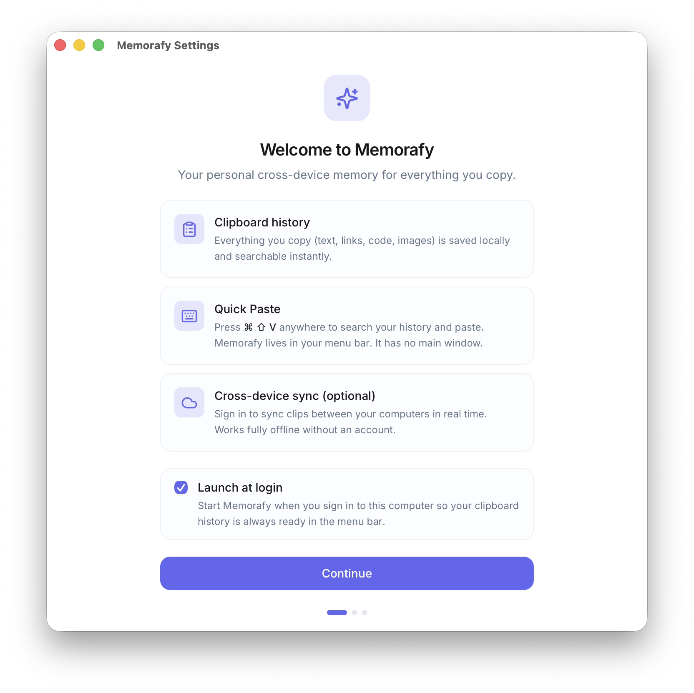
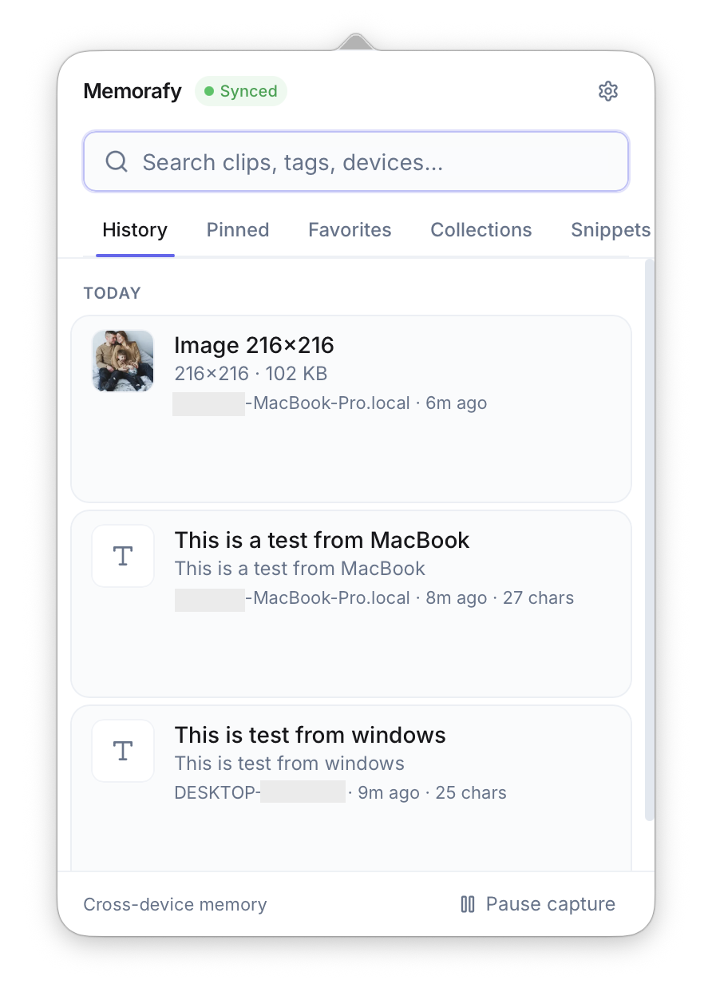
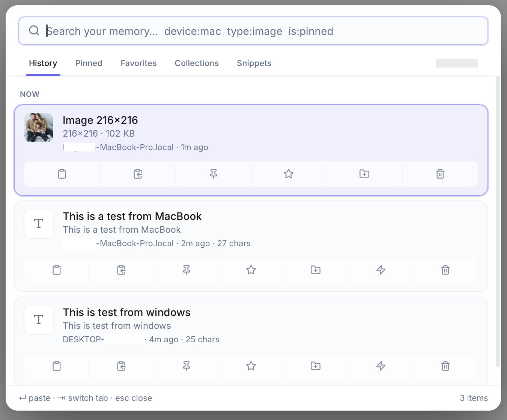
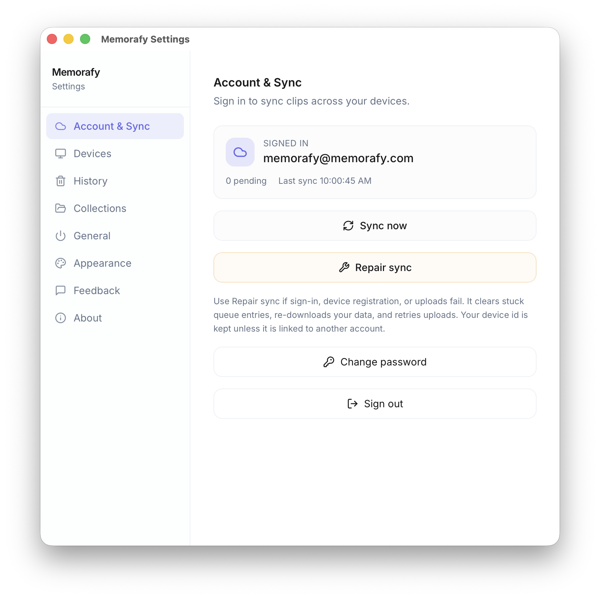

<p align="center">
  
</p>

<h1 align="center">Memorafy</h1>

<p align="center">
  <b>Your personal cross-device memory.</b><br/>
  A fast, private clipboard manager for Windows and macOS, with optional
  end-to-end encrypted sync between your computers.
</p>

<p align="center">
  <a href="https://github.com/ishola11/memorafy/releases/latest">Download</a> ·
  <a href="#features">Features</a> ·
  <a href="#installation">Install</a> ·
  <a href="#self-hosting-cloud-sync">Self-host sync</a> ·
  <a href="#development">Develop</a> ·
  <a href="#faq--troubleshooting">FAQ</a>
</p>

---

<p align="center">
  
</p>

<table>
  <tr>
    <td align="center"></td>
    <td align="center"></td>
    <td align="center"></td>
  </tr>
  <tr>
    <td align="center"><sub>Menu bar</sub></td>
    <td align="center"><sub>Quick paste overlay</sub></td>
    <td align="center"><sub>Settings</sub></td>
  </tr>
</table>

<sub>More screenshots, including the macOS menu bar and full dark mode, live in <a href="docs/screenshots">docs/screenshots</a>.</sub>

## What is Memorafy?

Memorafy quietly remembers everything you copy (text, links, code, images)
and gives it back to you instantly, anywhere, with one shortcut. It lives in
your system tray on Windows or the menu bar on macOS. There is no main
window to manage.

It is **local-first**: everything works fully offline, stored in a SQLite
database on your machine. If you want your clips on more than one computer,
sign in and they sync in real time, **end-to-end encrypted**, so the sync
server never sees what you copied.

## Features

- **Clipboard history** for text, URLs, code, and images, captured automatically
- **Quick Paste**: `Ctrl+Shift+V` (Windows) / `⌘⇧V` (macOS) opens a search
  overlay anywhere; `Enter` copies the selected clip
- **Instant search** with full-text indexing (SQLite FTS5) and filters like
  `type:image`, `is:pinned`, `device:mac`
- **Pins, favorites, collections, and snippets** to organize what matters and
  keep reusable text one shortcut away
- **Cross-device sync (optional)** in real time via Supabase, including images
- **End-to-end encryption**: clip content is encrypted on your device
  (XChaCha20-Poly1305) with a key derived from your password (Argon2id).
  The server stores only ciphertext and cannot even test clips for equality
- **Privacy by default**: content marked confidential by password managers
  is never captured, and capture can be paused any time from the tray
- **Retention**: auto-expire history after 30/60/90 days (pins, favorites,
  collections, and snippets are always kept)
- **Auto-updates** with signed installers via GitHub Releases

## Installation

Download the latest installer for your platform from
[**Releases**](https://github.com/ishola11/memorafy/releases/latest):

| Platform | File |
|---|---|
| Windows 10/11 | `Memorafy_x.y.z_x64-setup.exe` (or `.msi`) |
| macOS (Apple Silicon) | `Memorafy_x.y.z_aarch64.dmg` |
| macOS (Intel) | `Memorafy_x.y.z_x64.dmg` |

> **macOS note:** builds are not notarized yet. If Gatekeeper complains,
> right-click the app, choose **Open**, then **Open** again (one time only).

On first launch Memorafy walks you through a short welcome flow and lives in
the tray or menu bar from then on. Everything works without an account;
sign-in is only for cross-device sync.

## How sync & encryption work

- Clip content (text, titles, previews, URLs) is encrypted **on your device**
  before upload. Images are encrypted too.
- The encryption key is a random 256-bit key, wrapped with a key derived from
  your password (Argon2id). Only the wrapped blob is stored server-side.
  Each of your devices unwraps it at sign-in and caches it in the OS keychain.
- Changing your password re-wraps the key with no data loss. **Resetting a
  forgotten password** makes previously synced clips unreadable, unless
  another signed-in device still holds the key and heals the account
  automatically. That trade-off is what makes the encryption real.
- Metadata needed for syncing (timestamps, pinned/favorite flags, item kind,
  collection names) is not encrypted.

## Self-hosting cloud sync

The public builds ship pointed at the maintainer's Supabase project. If you
build from source or want your own backend, sync needs a free
[Supabase](https://supabase.com) project:

1. Create a project at [supabase.com](https://supabase.com).
2. Apply the schema, either way works:
   - **CLI (recommended)** — run from the **repo root**:
     ```bash
     npx supabase login
     npx supabase link --project-ref <your-project-ref> --workdir services
     npx supabase db push --workdir services
     ```
     Use `--workdir services` (not `services/supabase`). The CLI expects
     `services/supabase/config.toml` and `services/supabase/migrations/`.
     `supabase status` needs Docker (local stack only); ignore that if you
     only push schema to the hosted project.
   - **Or** connect the repo via the Supabase **GitHub integration**
     (Project Settings → Integrations → GitHub) with working directory
     `services/supabase`; migrations then apply on every push.
3. Put your project URL and anon key in `apps/desktop/.env`:
   ```env
   SUPABASE_URL=https://xxxx.supabase.co
   SUPABASE_ANON_KEY=eyJ...
   ```
   The anon key is safe to embed, since row-level security is the boundary.
   Never use the `service_role` key here.

Release builds embed these values at compile time from the same environment
variables. Without them, Memorafy simply runs local-only.

## Development

### Prerequisites

- [Node.js](https://nodejs.org/) 20+
- [Rust](https://rustup.rs/) (stable)
- **Windows:** Visual Studio Build Tools with the *Desktop development with
  C++* workload, and WebView2 (preinstalled on Windows 11)
- **macOS:** Xcode Command Line Tools

### Run it

```bash
git clone https://github.com/ishola11/memorafy
cd memorafy
npm install
npm run tauri dev
```

Dev builds store secrets in the local database instead of the OS keychain
(this avoids macOS keychain prompts on unsigned binaries) and read Supabase
config from `apps/desktop/.env` at runtime.

### Project structure

```
memorafy/
├── apps/desktop/            # The Tauri app
│   ├── src/                 # React UI (tray panel, quick paste, settings, onboarding)
│   └── src-tauri/           # Rust core
│       └── src/
│           ├── clipboard/   # Watcher, image handling, concealed-content detection
│           ├── sync/        # Engine, Supabase client, realtime, auth
│           ├── db/          # SQLite (rusqlite + FTS5)
│           ├── crypto.rs    # End-to-end encryption
│           ├── keychain.rs  # OS credential storage
│           └── logging.rs   # Rotating file logs + panic hook
├── packages/shared-types/   # TypeScript types shared with the UI
└── services/supabase/       # Cloud schema (CLI migrations) + config
```

### Tests

```bash
cd apps/desktop/src-tauri && cargo test     # Rust (incl. crypto + DB integration)
cd apps/desktop && npx tsc --noEmit         # TypeScript
```

### Schema changes

Add a new timestamped file under `services/supabase/migrations/` in the same
PR as the code that needs it. Never edit applied migrations, and never make
schema changes through the dashboard SQL editor.

## Building releases

Releases are built and signed by GitHub Actions on tag push:

1. One-time setup: generate updater keys (`npm run generate:updater-keys`),
   commit `apps/desktop/src-tauri/keys/memorafy.key.pub`, and add repository
   secrets `TAURI_SIGNING_PRIVATE_KEY`, `SUPABASE_URL`, `SUPABASE_ANON_KEY`.
2. Bump the version (in `package.json`, `apps/desktop/package.json`,
   `apps/desktop/src-tauri/tauri.conf.json`, `apps/desktop/src-tauri/Cargo.toml`).
3. `git tag vX.Y.Z && git push origin vX.Y.Z`

Installed apps pick the release up via **Settings → About → Check for
updates**.

> **Forks:** the auto-updater endpoint points at
> `github.com/ishola11/memorafy` in `tauri.conf.json`. Change it to your own
> repository, and generate your own signing keys.

## Logs & diagnostics

Memorafy writes daily-rotating logs (last 7 days) to:

- **Windows:** `%APPDATA%\com.memorafy.app\logs\`
- **macOS:** `~/Library/Application Support/com.memorafy.app/logs/`

Open them from **Settings → About → Open logs folder**. To report a bug, use
**Settings → Feedback**. It drafts a GitHub issue you review before
anything is sent, with an explicit opt-in diagnostics preview.

## FAQ & Troubleshooting

**Nothing happened after I installed it.**
Memorafy is a tray/menu-bar app. Look for its icon there, and press
`Ctrl+Shift+V` / `⌘⇧V` for Quick Paste.

**The Quick Paste shortcut doesn't work.**
Another app may already own that combination. Memorafy logs a warning and
keeps running; use the tray menu's *Quick Paste* entry meanwhile.

**"Sync encryption is locked" in Settings.**
Your device doesn't hold the encryption key yet (fresh install, app update
that introduced encryption, or a password reset). Enter your password in the
card to unlock. Sync pauses rather than uploading anything unencrypted.

**Port 1420 already in use (development).**
A previous dev server is still running:
```powershell
Get-NetTCPConnection -LocalPort 1420 -ErrorAction SilentlyContinue |
  ForEach-Object { Stop-Process -Id $_.OwningProcess -Force }
```

**How do I completely remove Memorafy?**
**Settings → General → Erase all local data** wipes the database, images,
settings, and keychain entries. Then uninstall via your OS as usual. Cloud
data (if you synced) is deleted from **Settings → History → Clear →
Everywhere** while signed in.

## Contributing

Bug reports, feature requests, and PRs are welcome. See
[CONTRIBUTING.md](CONTRIBUTING.md). For security issues, see
[SECURITY.md](SECURITY.md) and please don't open public issues for those.

## License

[MIT](LICENSE) © Ishola and Memorafy contributors
